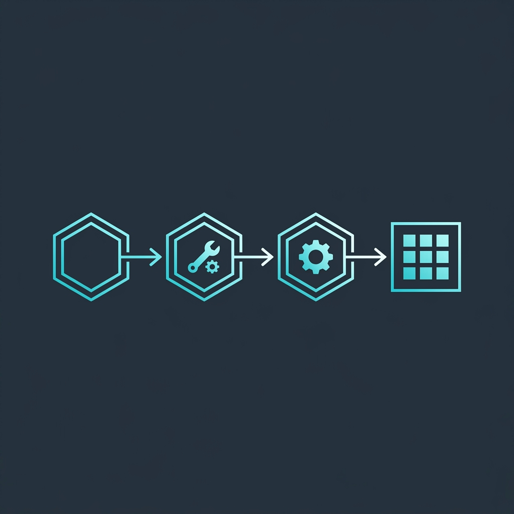

# 🎭 LLM Actor: Industrial-Grade LLM Throughput for Python

<p align="center">
  
</p>

<p align="center">
  <a href="https://pypi.org/project/llm-actor/"></a>
  <a href="https://github.com/your-username/llm-actor/actions/workflows/test.yml"></a>
  <a href="https://opensource.org/licenses/MIT"></a>
  <a href="https://www.python.org/downloads/release/python-3130/"></a>
</p>

<p align="center">
  <i>🌐 Documentation: <b>English</b> | <a href="docs/README.ru.md">Russian</a></i>
</p>

**LLM Actor** is a high-performance orchestration layer designed to handle Large Language Model (LLM) requests at scale. Inspired by the **Actor Model**, it solves the "last mile" of production LLM integration: handling concurrency, ensuring resilience, and managing task priority without overhead.

---

## 🚀 Why LLM Actor?

Most developers start with simple API calls. But when you move to production, you quickly hit:
- **Rate Limit Exhaustion**: No global coordination for token usage.
- **Provider Outages**: One slow response can hang your entire app.
- **Unreliable Parsing**: LLMs output garbage; your app crashes.
- **Lack of Priority**: Background tasks block high-priority user UI requests.

**LLM Actor** fixes this. It’s not just a wrapper; it’s a **resilient worker pool** built to sit between your application logic and your LLM providers.

---

## ✨ Key Features

- **⚡ High Throughput Actor Pool**: Efficiently manage hundreds of concurrent requests using a dedicated worker pool.
- **🧠 Intelligent Resilience**: 
    - **Circuit Breaker**: Detects provider failures and "fails fast" to protect your infrastructure.
    - **Exponential Backoff**: Automatic retries for transient HTTP errors (429, 502, 503).
    - **Semantic Validation**: Typed response validation with Pydantic; auto-retry on schema mismatch.
- **🛠️ Built-in Tool Calling Loop**: Native support for complex agentic flows. Run multiple tools **in parallel** to slash latency.
- **⚖️ Global Priority Queue**: Assign priorities to tasks. Ensure user-facing interactions always jump to the front of the line.
- **🧩 Multi-Provider & Self-Hosted**: 
    - Native support: OpenAI, Anthropic, Sber GigaChat.
    - Proxy support: **vLLM**, **Ollama**, and any OpenAI-compatible endpoint.
- **🔭 Deep Observability**: Full **OpenTelemetry** integration. Trace every request from the queue through the actor to the final provider response.

---

## 📦 Installation

```bash
# Install core package
pip install llm-actor

# Install with your preferred providers
pip install "llm-actor[openai,anthropic]"

# Full installation (all providers + metrics)
pip install "llm-actor[all]"
```

---

## ⚡ Quick Start: 60 Seconds to Scale

Create a service and start processing tasks with priority and auto-recovery:

```python
from llm_actor import LLMActorService, LLMActorSettings, Priority
from pydantic import BaseModel

# 1. Setup Service
service = LLMActorService.from_openai(
    api_key="sk-...", 
    model="gpt-4o",
    settings=LLMActorSettings(LLM_NUM_ACTORS=10) # 10 concurrent workers
)

# 2. Define Output Schema
class UserProfile(BaseModel):
    name: str
    skills: list[str]

# 3. Use via Context Manager (handles Start/Stop automatically)
async with service:
    # 4. Queue a High-Priority Task
    request = service.request(
        "Extract profile from: Alex is a Senior Python Dev with LLM expertise.",
        response_model=UserProfile,
        priority=Priority.HIGH
    )

    # 5. Get Your Results (Blocking or Async)
    result = request.get()
    print(f"Found: {result.name} with skills: {result.skills}")
```

---

## 📊 Provider Support Matrix

| Provider | Generations | Parallel Tools | Tested |
|---|---|---|---|
| **OpenAI / compatible** | ✅ | ✅ | ✅ Full |
| **Anthropic** | ✅ | ✅ | ✅ Full |
| **vLLM / Ollama** | ✅ | ✅* | ✅ Full |
| **Sber GigaChat** | ✅ | ⚠️ | ⏳ Experimental |

*\*Tool calling in vLLM requires specific server-side flags.*

---

## 🛡️ Built for Reliability

| Mechanism | Description |
|---|---|
| **Actor Supervision** | If a worker process crashes, it's automatically restarted by the supervisor. |
| **Backpressure** | Prevents system overload by limiting the number of active tasks. |
| **Otel Tracing** | Visualize latency including "Queue Wait Time" vs "In-LLM Time". |

---

## 🤝 Contributing

We love contributions! Whether it's adding a new provider adapter, fixing a bug, or improving documentation.

1. Fork the repo.
2. Install dev dependencies: `uv sync --all-extras --group dev`
3. Run tests: `pytest tests/unit`
4. Submit your PR!

---

## 📜 License

Distributed under the **MIT License**. See `LICENSE` for more information.

---

## 📚 Examples & Advanced Usage

Check out the [examples/](examples/) directory for complete, runnable scripts:

1.  **[Basic Generation](examples/01_basic_generation.py)**: Quick start with any provider.
2.  **[Structured Output](examples/02_structured_output.py)**: Extract data into Pydantic models.
3.  **[Tool Calling](examples/03_tool_calling.py)**: Orchestrate complex agentic loops with parallel tool execution.

---

<p align="center">Built with 💙 for the AI Developer Community.</p>
